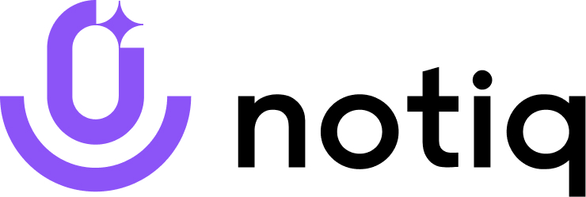
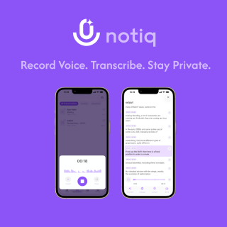

  

**Notiq — Smart Voice Notes with Offline AI and Total Privacy**

Notiq is your intelligent voice notebook — designed for people who value privacy, clarity, and focus.  
It transforms spoken words into organized notes and to-do lists with the help of on-device AI, without ever connecting to the cloud.

Everything in Notiq happens locally on your iPhone: speech recognition, transcription, and note creation.  
You can record ideas, meetings, and thoughts anywhere — even without an internet connection.  
Each note is instantly transcribed into text, structured automatically, and stored with AES-256 encryption for maximum protection.

Unlike typical voice recorders or online transcription tools, Notiq never uploads or shares your data.  
It’s a productivity tool built entirely around privacy — smart, elegant, and secure by design.

 

---

## ✨ Features

- 🎙️ **Voice Notes** — record and transcribe offline in real time  
- 📅 **Meeting Recorder** — capture long sessions with background mode and time-stamps  
- ✅ **Smart Voice To-Dos** — create task lists simply by speaking  
- 🧠 **On-Device AI** — all recognition and processing happen locally  
- 🔐 **AES-256 Encryption** — advanced, bank-level security for every note  
- 🌍 **Multilingual Speech Recognition** — English, Spanish, German, French, and more  
- 📂 **Folders** — organize recordings and tasks by project or topic  
- 📵 **No Cloud, No Account** — your notes stay yours, always offline  

---

## 🔐 Privacy by Design

Privacy isn’t a feature — it’s the foundation.  
Notiq never sends audio or text to external servers.  
All AI models run directly on your device, and all data is encrypted using AES-256 before storage.  
You don’t need an account, and nothing is ever synced or backed up online.  

Your voice, your notes, your control.  

---

## 🧩 Technology

Built natively for iOS with **SwiftUI** and **on-device AI frameworks**.  
Notiq uses optimized neural speech recognition for fast, accurate offline transcription, even during long recordings.  
Every operation — from recognizing speech to creating structured to-dos — runs locally, so performance remains fast and private.  

---

## 📥 Download

> Notiq is available on the App Store  

---

## 📄 Resources

- [Landing Page](https://toriviktoria.github.io/notiq-public/)
- [Privacy Policy](https://toriviktoria.github.io/notiq-public/privacy)
- [Terms of Use](https://toriviktoria.github.io/notiq-public/terms)
- [Support](https://toriviktoria.github.io/notiq-public/support)

---

## 🧠 Keywords

`voice notes`, `voice memos`, `voice to-dos`, `speech recognition`,  
`offline transcription`, `ai note taker`, `secure notes`,  
`aes256`, `on-device ai`, `private recorder`, `productivity`, `ios`, `swift`

---

Smart. Private. Voice-Powered.