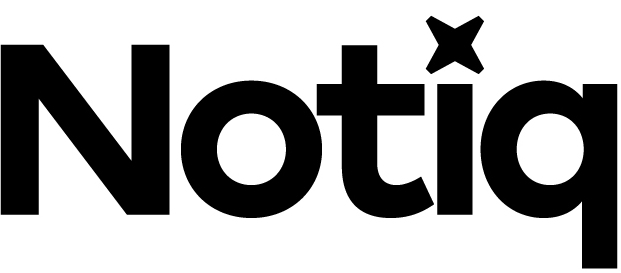
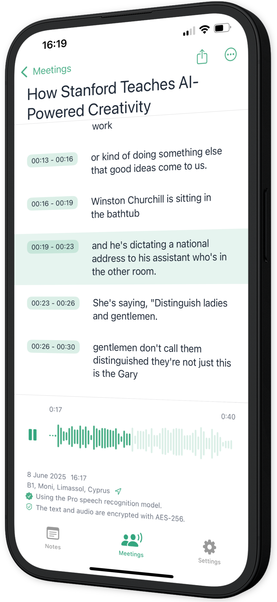

  

**Notiq — Your Private Notebook with Voice Transcription and Speech Recognition. All on device.**

Notiq is a secure note-taking app that converts your voice and scanned images into text. All powered by a fast neural network running directly on your device.
Capture voice memos, write thoughts, scan documents — or even record entire meetings in the background. With built-in speech recognition and voice transcription, everything is instantly turned into text, searchable and time-stamped.

## ✨ Features

- 🎙️ **Voice Memos** with offline transcription (speech recognition)
- 📝 **Text Notes** with smart organization
- 📷 **Scan Text** using OCR (Optical Character Recognition)
- 🔐 **AES‑256 Encryption** for all your notes
- 🎧 **Meeting Recorder** with background recording
- 🧠 **On-device AI** for transcription and summarization
- 🔎 **Full-text Search** across all note types
- 📂 **Folders** to organize your thoughts
- 📵 **No accounts. No cloud.**

## 🔐 100% Private

- No user account required  
- Works fully offline for all core features  
- No data ever leaves your device  
- Your data, your control  

## 📥 Download

> Notiq is available on the App Store  

## 📄 Resources

- [Landing Page](https://toriviktoria.github.io/notiq-public/)
- [Privacy Policy](https://toriviktoria.github.io/notiq-public/privacy)
- [Terms of Use](https://toriviktoria.github.io/notiq-public/terms)
- [Support](https://toriviktoria.github.io/notiq-public/support)

---

## 🧠 Keywords

`voice notes`, `voice memos` `speech recognition`, `note-taking`, `offline notes`, `ai`, `ocr`, `voice transcription`, `secure notes`, `aes256`, `productivity`, `ios`, `swift`, `on-device ai`

---

Record. Transcribe. Stay private.
